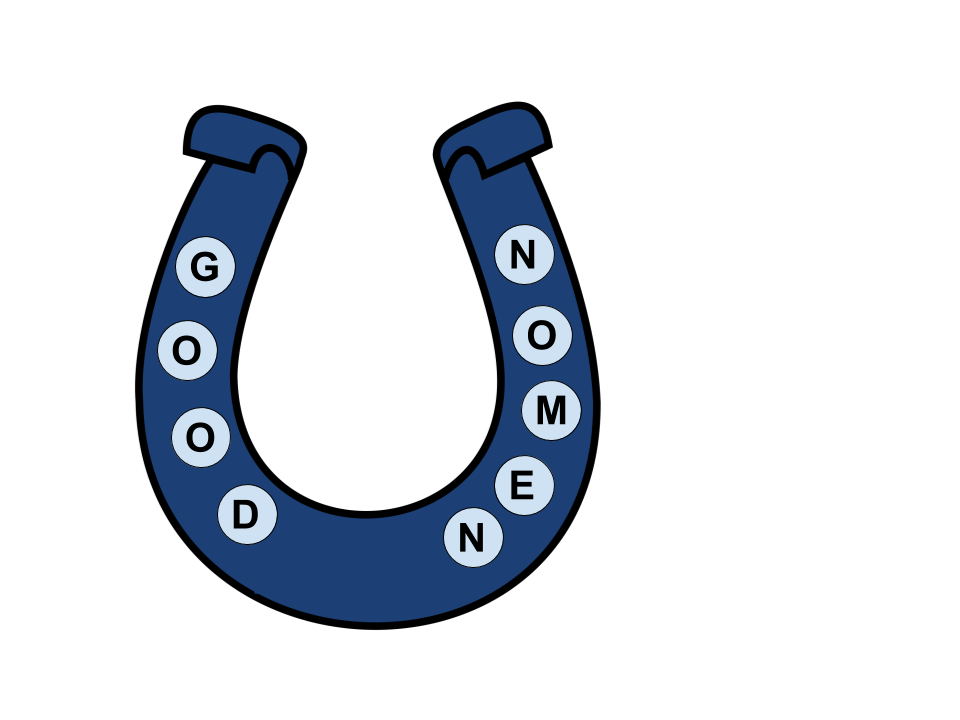

## Introduction

*GoodNomen* enables researchers to standardize clinical data files through a user-friendly interface.

## Background
Terms used to describe medical conditions, treatments, tests, and outcomes vary widely within and across datasets. This creates difficulties when analyzing such data. To address this problem, researchers have produced terminologies and thesauri that define standardized terms and related synonyms for many biomedical concepts. While these resources contain valuable information, restructuring clinical data to conform to these standards can be time-consuming and require computational expertise. We have developed Good Nomen, a Shiny application that allows users to standardize data interactively in a high-throughput manner.

## Online Option
GoodNomen is available as an online Web application on [shinyapps.io](https://parkerac.shinyapps.io/shiny_app/).
